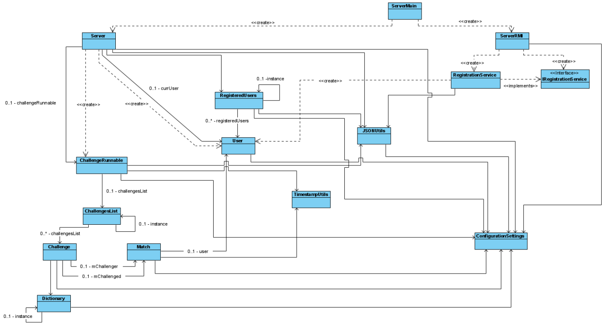
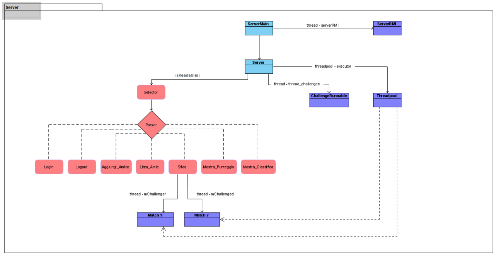
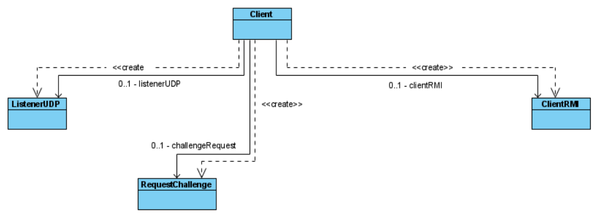
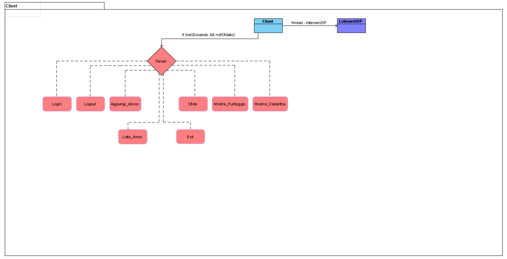

# WordQuizzle 2019/2020 - Computer Networks and Laboratory Project - University of Pisa

## Introduction
This project aims at developing a Client-Server service a word transaltion game (IT-ENG) between registered users. The two core components are the Client and the Server, the protocols used for their communication are:

* **UDP:** request/management of a translation challenge
* **RMI:** user registration
* **TCP:** remaining functionalities

The service is designed to operate locally, therefore the ports of the Clients after the first one, which occupies the default one, must be specified on the command line.

## Server
The manegements of the Client wanting to access the service is implemented through a Selector (NIO), this approach is more efficient w.r.t. a multithreaded operation.

### Server.classes

* **User:** maintains user data and data needed for communicating with the server
* **RegisteredUsers:** maintains list of registered users and methods for managing it
* **Server:** handles TCP requests from Clients through a Selector and a Parser (for recognizing commands)
* **Main:** initialization of TCP and RMI Server

### Utils
* **JSONUtils:** utils to read, create and update JSON files and objects
* **TimestampUtils:** utils for setting and querying timeouts (related to games and challenge requests)
* **Dictionary:** utils for loading words contained in the file *words.txt* and for randomly choosing the words during a game
* **ConfigurationSettings:** contains default settings

## Challenge
* **Match (*thread*):** see *Server.threads*
* **Challenge:** management of a challenge between two users (sending of victory/defeat/tie messages to the users)
* **ChallengesList:** maintains the list of challenges in execution
* **ChallengeRunnable (*thread*):** see *Server.threads*

## RMI
* **IRegistrationService:** interface of RMI remote object
* **RegistrationService:** contains the method allowing user registration (and then stores the related information in a JSON file)
* **ServerRMI (*thread*):** see *Server.threads*

## Server.threads

* **ServerRMI:** handles registration requests
* **ChallengeRunnable:** handles challenges in execution and their termination
* **Match (user) challenger:** handles the game for the challenger user and sends the message with game statistics at the end
* **Match (user) challenged:** handles the game for the challenged user and sends the message with game statistics at the end

## Server.concurrency
The classes in which conrruency is handled:

* **ChallengesList**
* **RegisteredUsers**
* **User**
* **Match**

The two lists *ChallengesList* and *RegisteredUsers*, respectively related to challenges in execution and registered users, are implemented with the singleton-pattern so that, in the entire program, it is guaranteed that there is only one instance of the two lists in execution. By using this approach the possibility of creating not needed instances of these two objects is avoided.

Methods accessible by multiple threads, both *Match* and *ChallengeRunnable*, are **synchronized**. In addition, for handling the concurrency of some boolean values, the type **AtomicBoolean** (needed when the values can be accessed/modified by more than one thread) has been used.

### Data Structures
*ConcurrentHashMap* was used, in order to improve performance, where it was needed to guarantee concurrent access by multiple threads.

* **User:** for the friendlist of a user
* **RegisteredUser:** for the registered users
* **ChallengesList:** for the list of challenges in execution

In order to store the words available for a game, *ArrayList* has been used. The relationship between a word and its translation is maintained with the indexing in the ArrayList.

* **Dictionary:** loading words from the file
* **Challenge:** words and corresponding translations for a challenge
* **Match:** words and translations (given as answer by users) in a game

### Challenge Management
For managing a challenge, four (4) classes were implemented: *ChallengeRunnable.java*, *ChallengesList.java*, *Challenge.java*, and *Match.java*:

* **Match (*thread*):** contains information related to a game (associated to a user), stores the answers given by the users and checks if they're correct or not by comparing them with the correct translations
* **Challenge:** contains information related to a challenge, and the instances of the two *Match*, in this class we also have the loading of the words from our file
* **ChallengesList:** list of *Challenge* objects, contains methods used for creating a new match, or for deleting an expired/terminated match
* **ChallengeRunnable (*thread*):** pooling on list of challenges in execution, sends messages of victory/defeat/tie to the users involved in a challenge

### Word-Translation Management
*Dictionary.java* is a singleton in which the words needed for game (they're stored in the file *words.txt*) are loaded. In this class we also find a method *getWords()*, used in *Challenge*, for applying a permutation to the set of words and for retrieving a default number (5) of words to be used in a game.

In *Challenge.java* we have the method used for interacting with the translation APIs, basically for retrieving the correct translation of each word. The method *getTranslation(String word)* requests the translation of a specific words, that is then stored in the ArrayList maintaining words translations.

### Data Backup
User information is persistant with a backup (file JSON *WQusers.json*). When a change occurs it is written to the mentioned file, for instance: a new user registration, adding a new friend, changes to user score (due to challenges victories/defeats).

With this approach it is possible to minimize the risk of losing data as a consequence of a sudden crash. There is obviusly a trade-off with performance, since this is a task executed after every single change. **A better approach would have been to implement a periodic backup task.**

## Client
The client implementation has a simple console interface. Since it wasn't a required we decided to not implement a GUI.

The command *--help* allows the user to visualize all available commands/operations.

### Client.classes

* **Client:** main class handling interactiong with the Server, there is a parser for line commands and a thread for sending challenge request (through Server interaction)
* **ListenerUDP:** see *Client.threads*
* **RequestChallenge:** sending a challenge request to another user
* **ClientRMI:** user registration client side

### Client.threads

In the client there is just one thread, the *ListenerUDP* waits for challenges request from other users (through Server interaction).

### Challenge Request Management
The user can answer to a challenge request from command line with *yes/no*, before a timeout expires (challenge refused automatically). The method *setChallengeReply(String reply)* of the class *ListenerUDP.java* sets the answer, empty if the timeout expired.

## Instructions
The available commands are the following:

* **Login <nickName> <password>:** login
* **Logout:** logout
* **Aggiungi_amico <nickName>:** add a new friend
* **Lista_amici:** retrieve your friendlist
* **Sfida <nickName>:** request a challenge to a friend (exception if *nickName* is not a friend)
* **Mostra_Punteggio:** retrieve your current score
* **Mostra_Classifica:** retrieve current ranking according to the user and its friends
* **Exit:** logout + close client service

### Eclipse
The project was realized using Eclipse (Java 11).

1. Open Eclipse &rarr; File &rarr; Import &rarr; Existing Project into workspace &rarr; Select project File System

After the project has been added to the workspace, in the case that the external libraries path has not been recognized automatically, it is necessary to import them manually from *Referenced Libraries* folder:
2. Right-click on the project &rarr; Properties &rarr; Java Build Path &rarr; Add External Class Folder

The project is ready to be executed, in order to run the Server you can simply select the *Server package* and click Run.

For the Client, considering that the project is implemented locally, you'll need to specify a non-used port for the Clients after the first one, since the default one (15002) will be occupied):
3. Right-click on the project &rarr; Run As &rarr; Run Configurations... &rarr; Arguments &rarr; Specify UDPport &rarr; 15003 &rarr; Run
